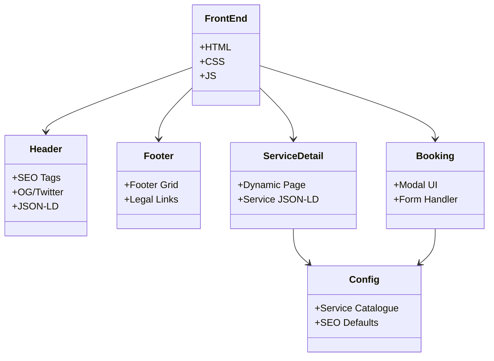

# GeekAssist Appliance – 100% Online Remote Tech Support

## Project Overview
A premium web application that provides **instant, 100% online remote technical support** for appliances, printers, and computers. All interactions are performed via secure screen‑share or video calls—no home visits required.

---

## Directory Structure
```
geekassistappli/
├─ assets/
│   ├─ css/styles.css          # Core styling (custom design system)
│   ├─ js/main.js              # Front‑end interactivity
│   └─ images/                 # Logos, icons, OG images
├─ includes/
│   ├─ header.php              # Dynamic SEO meta tags, OG/Twitter cards, JSON‑LD
│   └─ footer.php              # Footer layout & global scripts
├─ config.php                  # Global constants, SEO defaults, service catalogue
├─ index.php                  # Home page – hero, fast‑diagnosis grid, deep SEO block
├─ services.php               # Service catalog (17 remote services)
├─ service-detail.php         # Dynamic service detail pages (JSON‑LD schema)
├─ booking.php                # Booking modal & remote session starter
├─ contact.php                # Contact form & hotline information
├─ privacy-policy.php         # Privacy policy page (SEO ready)
├─ terms.php, disclaimer.php, cookie-policy.php, refund-cancellation-policy.php
├─ sitemap.xml                # XML sitemap for search engines
└─ README.md                  # **THIS FILE** – architecture & design documentation
```

---

## System Design
- **Frontend** – Vanilla HTML, CSS, PHP templating, and lightweight JavaScript. No heavy frameworks; custom design system gives premium UI/UX.
- **Backend** – PHP on Apache (XAMPP). All page data is pulled from `config.php` (service definitions) and rendered server‑side.
- **SEO Engine** – Centralised SEO constants (`DEFAULT_META_TITLE`, `DEFAULT_META_DESC`, `DEFAULT_META_KEYWORDS`, `DEFAULT_OG_IMAGE`) plus per‑page overrides. Meta tags, Open Graph, Twitter Cards, and JSON‑LD are generated in `includes/header.php`.
- **Remote Session Flow** – Users book via the **Booking Modal** → data sent to `booking.php` → a unique session link is created → specialist joins via encrypted screen‑share (256‑bit TLS).
- **Analytics & Schema** – Each service page embeds a **Service** schema (`Service` JSON‑LD). The home page embeds an **FAQPage** schema. The site is crawled via `sitemap.xml` and `robots.txt`.

---

## Flow Chart (User Journey)
```mermaid
flowchart TD
    A[Visit Home Page] --> B{Select Service Category}
    B -->|Printer| C[Printer Service Page]
    B -->|Appliance| D[Appliance Service Page]
    C --> E[View FAQ / Details]
    D --> E
    E --> F[Click "Start Remote Session"]
    F --> G[Booking Modal Opens]
    G --> H[Submit Booking Form]
    H --> I[Confirmation & Remote Link]
    I --> J[Technician joins via secure screen‑share]
    J --> K[Issue Resolved]
    K --> L[Post‑session feedback & 90‑day support]
``` 

---

## Diagram – Component Overview


---

## JSON‑LD Schema Summary
- **Home Page** – `FAQPage` schema with 5 common questions.
- **Service Detail Pages** – `Service` schema exposing:
  - `name`
  - `provider` (`OnlineBusiness` with site name)
  - `serviceType`
  - `areaServed`
  - `description`
  - `termsOfService` (link to `/terms.php`).
- **Global** – `OnlineBusiness` schema defined in `includes/header.php` for brand‑wide rich snippets.

---

## Prototype Overview (Textual)
| Page | Primary UI Elements |
|------|----------------------|
| **Home** | Hero banner, 2‑column fast‑diagnosis card grid, deep SEO content block, FAQ accordion.
| **Services** | Card list of 17 remote services, each linking to a detailed page.
| **Service Detail** | Service title, description, pricing badge, CTA buttons (book, call), JSON‑LD script.
| **Booking Modal** | Form fields – name, phone, email, device type, issue description; submit triggers remote session link.
| **Contact** | Hotline, email, quick‑link form, Google Maps placeholder.
| **Policy Pages** | Clean typography, SEO meta tags, hidden schema for legal compliance.

---

*This README is intentionally lightweight—only the structure, design, flow, diagrams, and schema are documented so that the repository’s prototype can be reviewed at a glance on GitHub.*
